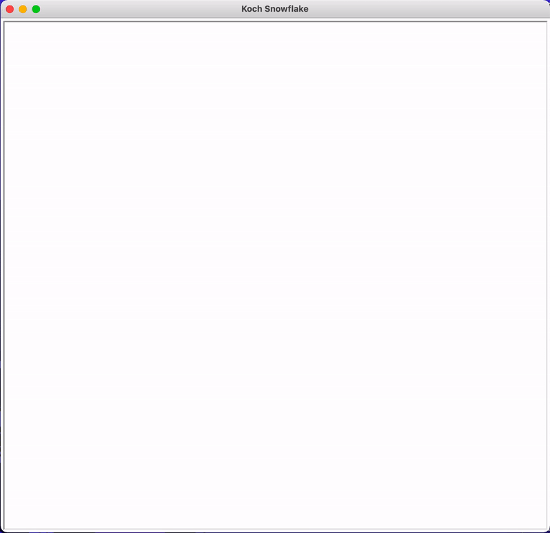
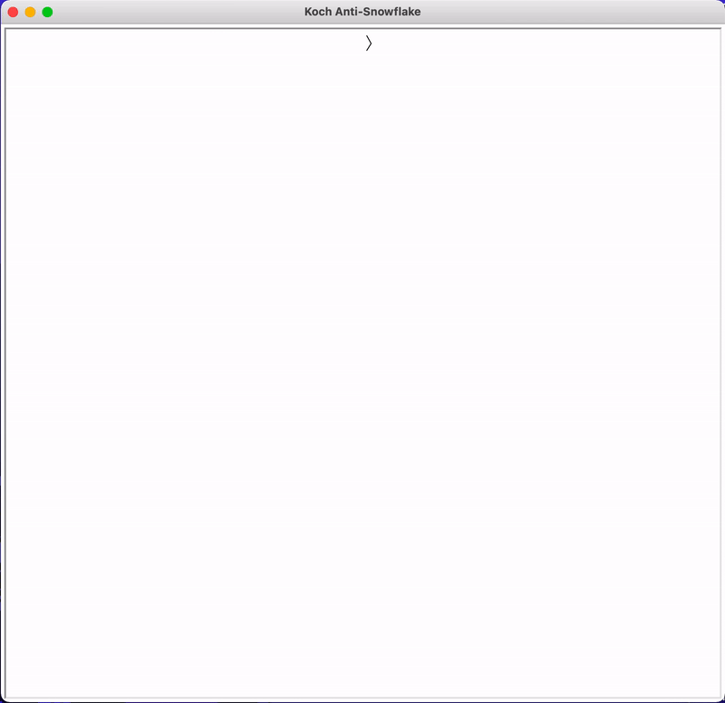
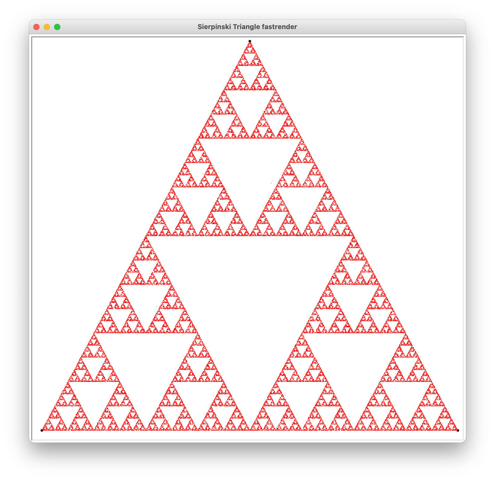

# FRACTALS!!

### This is a bunch of code utilising the python turtle library to draw fractals.

Run "Koch Snowflake.py" to generate a Koch snowflake.

Run "Koch Anti-Snowflake.py" to generate a Koch anti-snowflake.

Run "Sierpinski Triangle.py" to generate a Sierpinski triangle slowly, point by point.

Run "Sierpinski Triangle fastrender.py" to generate a Sierpinski triangle fast, all at once.
